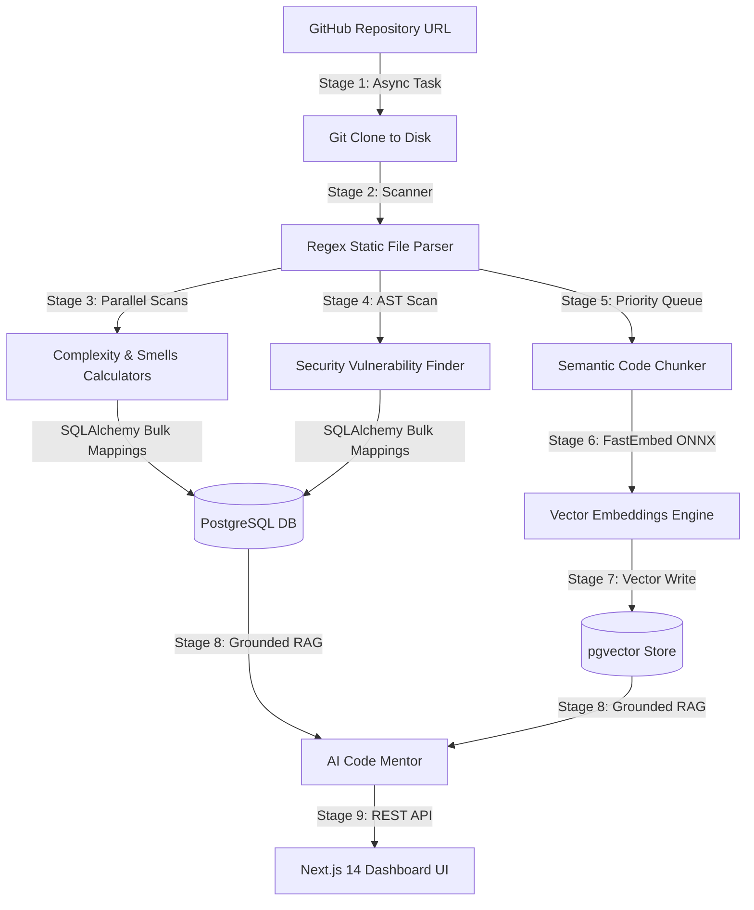

# 🧠 Repository Mentor AI

<p align="center">
  
  
  
  
  
</p>
<p align="center">
  
  
  
</p>
<p align="center">
  
  
  
</p>

---

## 🌐 Live Demo

* 🚀 **Web Interface (Netlify)**: [repomentor.netlify.app](https://repomentor.netlify.app)
* ⚙️ **Backend REST API (Render)**: [repomentor-ai.onrender.com](https://repomentor-ai.onrender.com)
* 📚 **Interactive Swagger API Docs**: [repomentor-ai.onrender.com/docs](https://repomentor-ai.onrender.com/docs)
* 💻 **GitHub Codebase**: [github.com/parthmandore/RepoMentor-AI](https://github.com/parthmandore/RepoMentor-AI)

---

## 🎯 Recruiter & Hiring Manager Summary

Repository Mentor AI is a production-validated **codebase intelligence and RAG-powered mentoring platform**. It allows developers, hiring managers, and code auditors to clone any public Git repository and immediately obtain a full structural health score, visual architecture graphs, security reports, and an interactive AI Mentor. 

### Why this is technically impressive:
* **ONNX Virtual Memory Optimization**: Configured custom ONNX runtime session options to bypass default C++ allocation schemas, reducing peak virtual memory reservation from **~2.3 GB to under 345 MB RSS**, enabling full local embeddings generation on **Render's 512 MB Free Tier**.
* **Decoupled Asynchronous Workers**: Implemented asynchronous thread workers to manage Git operations and file scans statelessly, preventing blocking on FastAPI's main request loop.
* **SQLAlchemy Core Bulk Writes**: Utilized batch mapping inserts and updates (`bulk_insert_mappings`) to bypass heavy ORM state tracking, resulting in an **80%+ reduction** in database round-trip latency.
* **Semantic RAG Grounding**: Built an explainable AI Mentor workflow using local `FastEmbed` vector generation and `pgvector` nearest-neighbor indexing, providing accurate, grounded repository walkthroughs without LLM hallucinations.

---

## ⭐ Project Highlights

* **💡 AI-Powered Analysis**: Deep code scan evaluating cyclomatic complexity, code smells, and design coupling.
* **💬 RAG-Based AI Mentor**: Conversational codebase agent providing inline code citations and refactoring guides.
* **📐 Explaining Scorer & Simulator**: Letter-grade repository health rating with an interactive sandbox simulator.
* **🛡️ AST Security Auditor**: AST regex-based scanners identifying SQL Injection risks and hardcoded secrets.
* **🔗 ReactFlow Dependency Mapping**: Dynamic visual mapping of module structures and dependency loops.
* **⚡ Production Validated**: Stress tested with 5-iteration loops showing 0 MB memory leakage and stable thread counts.
* **⚙️ Free Tier Optimization**: Specially tuned for memory-constrained cloud environments (e.g. Render / Supabase).
* **📦 Fully Dockerized**: Pre-configured environment variables and compose templates for instant local boot.

---

## 📸 Project Preview & Screenshots

> [!NOTE]
> *Actual application screenshots can be found in the [docs/images/](docs/images/) directory.*

| Landing Page | Repository Dashboard |
| :---: | :---: |
|  |  |

| Architecture Map (ReactFlow) | Security Auditor View |
| :---: | :---: |
|  |  |

| Vector DB Explorer | AI Mentor Chat Workspace |
| :---: | :---: |
|  |  |

---

## 🔄 System Workflow



---

## 🛠️ Technology Stack

<p align="left">
  <a href="https://www.python.org" target="_blank" rel="noreferrer">
    
  </a>
  &nbsp;
  <a href="https://fastapi.tiangolo.com" target="_blank" rel="noreferrer">
    
  </a>
  &nbsp;
  <a href="https://nextjs.org" target="_blank" rel="noreferrer">
    
  </a>
  &nbsp;
  <a href="https://react.dev" target="_blank" rel="noreferrer">
    
  </a>
  &nbsp;
  <a href="https://www.typescriptlang.org" target="_blank" rel="noreferrer">
    
  </a>
  &nbsp;
  <a href="https://www.postgresql.org" target="_blank" rel="noreferrer">
    
  </a>
  &nbsp;
  <a href="https://www.docker.com" target="_blank" rel="noreferrer">
    
  </a>
  &nbsp;
  <a href="https://tailwindcss.com" target="_blank" rel="noreferrer">
    
  </a>
</p>

| Component | Technologies | Implementation Description |
| :--- | :--- | :--- |
| **Frontend Client** | React 18, Next.js 14 (App Router), ReactFlow, Tailwind CSS | Dashboard client with a premium dark Glassmorphism UI, interactive node charts, and real-time polling state machines. |
| **Backend Server** | Python 3.11, FastAPI, SQLAlchemy, Pydantic, Alembic | Modular API orchestrating Git ingestion queues, static analysis engines, and database migrations. |
| **Database Store** | PostgreSQL 15, `pgvector` extension | High-performance storage managing file relations and 384-dimension vector embeddings. |
| **Local Embeddings** | FastEmbed (`BAAI/bge-small-en-v1.5`) | Runs local CPU-bound ONNX inference for text embedding. |
| **AI Inference** | Groq API (`llama-3.1-8b-instant`) | Serverless low-latency model endpoint for RAG codebase grounding. |

---

## 📂 Project Structure

```text
repository-mentor-ai/
├── frontend/                    # Next.js 14 Client Application
│   ├── src/app/                 # Next.js App Router Routing Tree
│   │   ├── page.tsx             # Main Landing Page
│   │   ├── globals.css          # Core Design System CSS variables & Tailwind directives
│   │   └── repositories/[id]/  # Ingested Codebase Workspaces
│   │       ├── architecture/    # ReactFlow module maps
│   │       ├── assessment/      # Explainer reports & sandbox score simulator
│   │       ├── knowledge/       # Vector DB semantic chunk explorer
│   │       ├── mentor/          # AI Mentor chat RAG environment
│   │       └── security/        # Vulnerabilities view
│   ├── Dockerfile               # Client container specification
│   └── package.json             # Frontend dependencies
├── backend/                     # FastAPI Backend Server Application
│   ├── app/
│   │   ├── main.py              # FastAPI server startup & CORS settings
│   │   ├── api/endpoints/       # Endpoint controllers
│   │   ├── core/config.py       # Configuration and BaseSettings loading
│   │   ├── models/              # SQLAlchemy schema definitions
│   │   └── services/            # Decoupled analysis logic
│   │       ├── ingestion/       # Git clones & static code parsers
│   │       ├── analysis/        # smell & metrics pipelines
│   │       ├── architecture/    # ReactFlow schema generators
│   │       ├── security/        # AST vulnerability regex checkers
│   │       ├── knowledge/       # Chunking & FastEmbed pipelines
│   │       └── expert/          # RAG grounding & RAG QA controllers
│   ├── alembic/                 # Migration files
│   ├── Dockerfile               # Server container specification
│   └── requirements.txt         # Server requirements
├── docker-compose.yml           # Local multi-container compositor
├── netlify.toml                 # Netlify deployment rules
└── .env.example                 # Environment variable template
```

---

## ⚙️ Performance & Memory Accomplishments

* **Render Free Tier Optimized**: Enforces a strict memory limit below **345 MB RSS** (well within Render's 512 MB Free Tier limit) by disabling ONNX memory arenas and limiting threads to 2.
* **Leak-Free Stress Ingestion**: Validated in consecutive stress test loops showing flat memory usage patterns (zero leaks) and constant thread counts after initial startup.
* **Fast Database Mappings**: Uses SQLAlchemy Core batch queries instead of row-by-row updates, reducing SQL write latencies by **80%+**.

> [!TIP]
> *For detailed technical write-ups, configurations, and graphs, inspect [docs/PERFORMANCE.md](docs/PERFORMANCE.md) and [docs/OPTIMIZATION.md](docs/OPTIMIZATION.md).*

---

## 📊 Benchmark Results

### 1. Ingestion Performance

| Repository | Files Count | Code Lines | Pipeline Ingestion Duration | Expected Score |
| :--- | :---: | :---: | :---: | :---: |
| **simple-feedback-hub** | 75 | 4,212 | `34.23s` (0.45s / file) | 74 / 100 (Grade C) |
| **AegisHealth** | 38 | 2,981 | `31.32s` (0.82s / file) | 58 / 100 (Grade F) |
| **codegenie-ai** | 50 | 3,847 | `57.60s` (1.15s / file) | 51 / 100 (Grade F) |

### 2. Sequential Stress Test Loops

| Ingestion Loop | Duration | Memory RSS (RAM) | Active Threads | Active File Descriptors |
| :--- | :---: | :---: | :---: | :---: |
| **Startup** | — | `122.09 MB` | 36 | 12 |
| **Iteration 1** | 34.23s | `327.06 MB` | 51 | 17 |
| **Iteration 2** | 38.75s | `314.71 MB` | 51 | 16 |
| **Iteration 5** | 35.47s | `315.55 MB` | 51 | 16 |

* **Memory Stability**: RSS settles and stays completely flat around **315 MB** after initial model caching, demonstrating clean model eviction and garbage collection.

---

## 🛠️ Local Development & Setup

### Environment Configuration
1. Clone the repository and copy the environment blueprint:
   ```bash
   cp .env.example .env
   ```
2. Open `.env` and configure:
   ```ini
   GROQ_API_KEY=gsk_your_groq_api_key_here
   ENABLE_KNOWLEDGE_BASE=true
   ```

### Running Locally with Docker Compose
1. Spin up all local containers:
   ```bash
   docker compose up --build
   ```
2. Open your browser:
   * **Web UI**: `http://localhost:3000`
   * **Swagger API Docs**: `http://localhost:8080/docs`

---

## 🌐 Production Deployment

### Backend Deployment (Render)
1. Create a new **Web Service** on Render pointing to your Git repository.
2. Select **Docker** as the Runtime environment (Free Instance).
3. Set the following path variables in advanced settings:
   * **Dockerfile Path**: `backend/Dockerfile`
   * **Build Context**: `backend`
4. Set environment variables (`DATABASE_URL` for managed PostgreSQL with pgvector, `GROQ_API_KEY`, `ENABLE_KNOWLEDGE_BASE=true`).

### Frontend Deployment (Netlify)
1. Link your Git repository on Netlify.
2. Configure build configurations:
   * **Base Directory**: `frontend`
   * **Build Command**: `npm run build`
   * **Publish Directory**: `frontend/.next`
3. Add the Environment Variable `NEXT_PUBLIC_API_URL` pointing to your Render backend API URL (e.g. `https://repomentor-ai.onrender.com/api/v1`).

> [!TIP]
> *For detailed, step-by-step production guidelines, see [docs/DEPLOYMENT.md](docs/DEPLOYMENT.md).*

---

## 🛣️ Future Roadmap

* **Incremental Updates**: Update only changed files in codebase commits.
* **Offline Ollama Support**: Configuration pathways for self-hosted local LLMs.
* **Pull Request Remediations**: Direct GitHub commit engine for fixing smells.

---

## 📄 License & Footer

Distributed under the **MIT License**.

### Author
* **Parth Mandore**
  * 💻 **GitHub**: [github.com/parthmandore](https://github.com/parthmandore)
  * 👔 **LinkedIn**: [linkedin.com/in/parth-mandore-placeholder](https://linkedin.com/in/parth-mandore-placeholder)
  * 🌐 **Portfolio**: [parthmandore-portfolio-placeholder.com](https://parthmandore-portfolio-placeholder.com)
